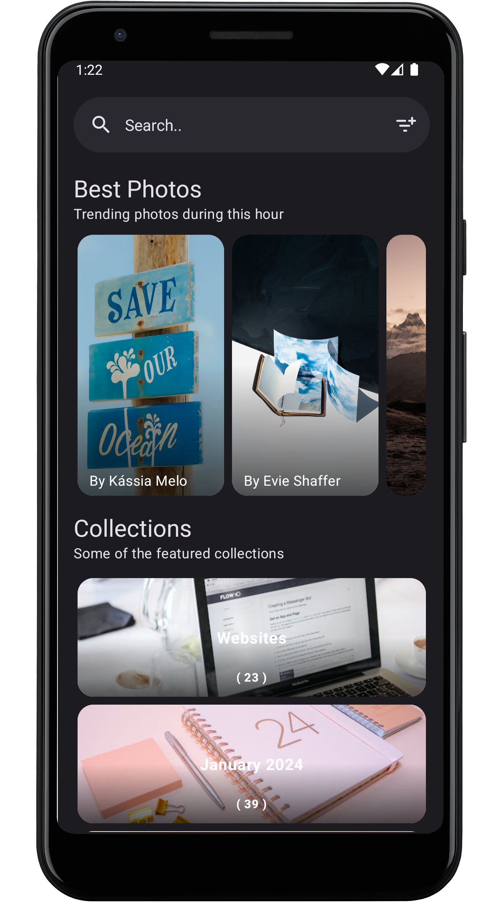
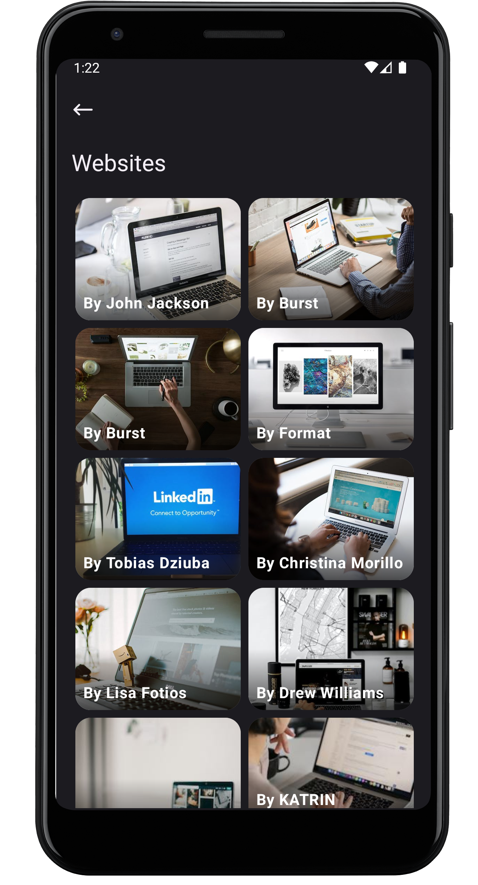
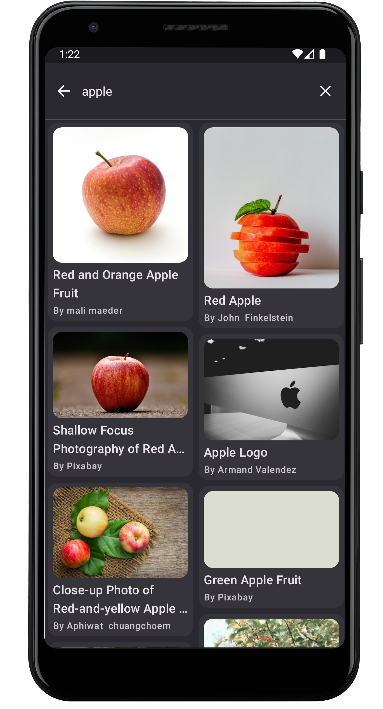
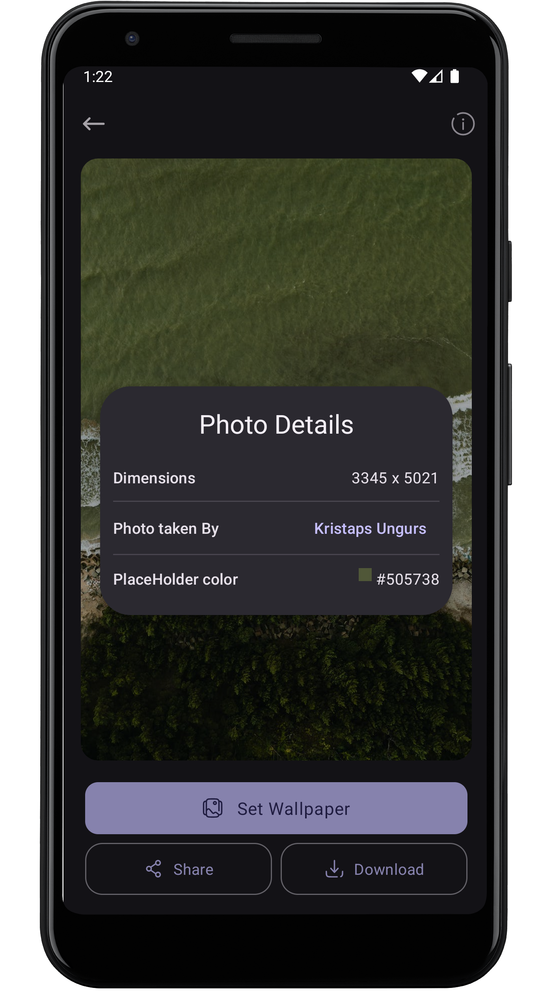

# PexelsApp

An Android wallpaper app created using [pexelsapi](https://www.pexels.com/api/),

A user can browse though thousands of images and categories and also can download or share or apply
the image as wallpaper

## 🖼️ Features

- Search Millions of Images
- Categories to get images from
- Curated Images
- Share and Download the images

## 🖼️ Screenshots

These are some screenshots of the App. For more head to [screenshots](./screenshots)

<div >
  
  
  
  
</div>

## 🏃 Get Started

Follow these steps to build this project:

1. **Clone the Project:**

   ```bash
   git clone https://github.com/tuuhin/PexelsAndroidApp/tree/main
   ```

2. **Authorization**

    - To run the app you need an api key, you can create an api key
      from [here](https://www.pexels.com/join/).
    - Create a file in `root` as `pexels.propeties` file , without this file you will be not able to
      make the project.
    - In the file create two properties

      ```properties
      API_KEY=<your api key>
      BASE_URL=https://api.pexels.com
      ```

    - Paste your api key, and you are good to go.

## 🤙 Contributing

Contributions from the community. If you would like to contribute please follow these guidelines:

1. Fork the repository and create your branch from `<your-username>-develop`.
2. Make changes and test thoroughly.
3. Create a pull request with a detailed description of the changes.

## 🔨 Issues

If you encounter any bugs, glitches, or have suggestions for improvements, please create an issue in
the GitHub repository.

### 😅 Conclusion

PexelsApp was mainly created to try out the old view system of android development, but the app
indeed turns out to be a good one.

If you find any possible changes that can be made to make it much better please let it be known in
the issues.
